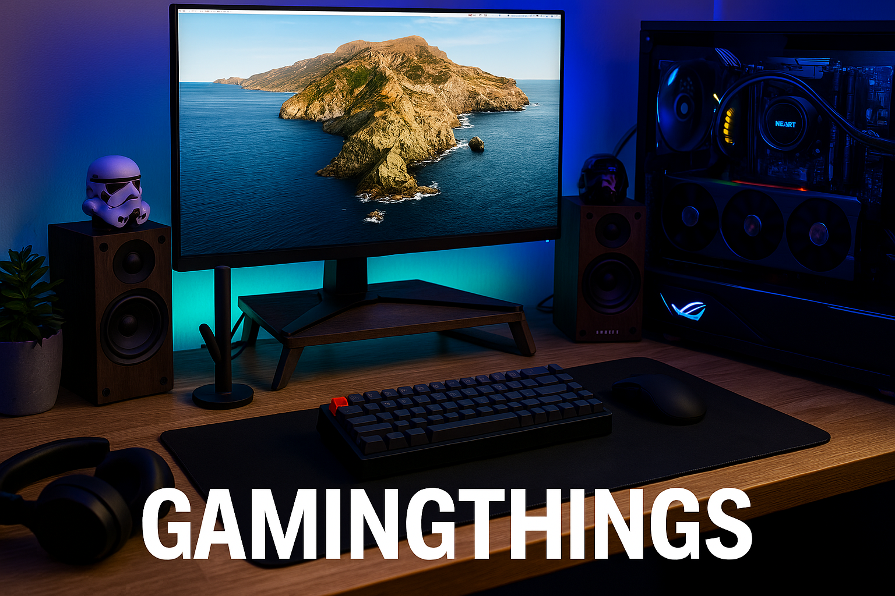
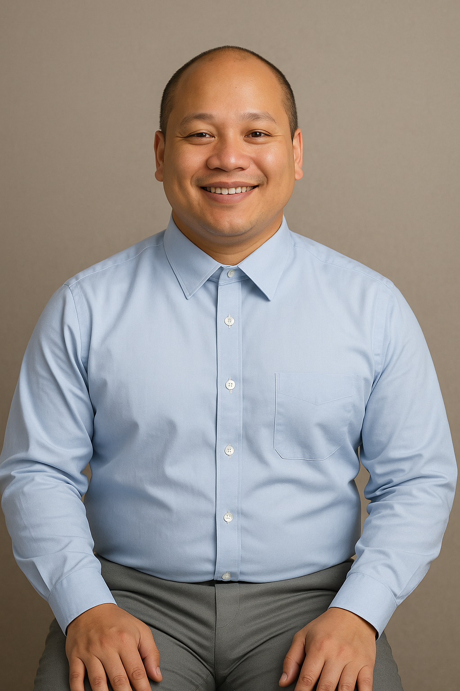

<!-- Banner -->
<p align="center">
  
</p>

<!-- Foto de perfil -->
<p align="center">
  
</p>

<h1 align="center">Hola 👋, soy Richard</h1>
<h3 align="center">Desarrollador Full Stack en formación&nbsp;|&nbsp;Fundador de CryptoJazzHolders 🚀</h3>

---

- 💻 Actualmente trabajando en **CryptoJazzHoldez** y en la tienda online de productos electrónicos:  
  <a href="https://gamingthigns.store" target="_blank"><strong>Gaming Thigns</strong></a>
- 🌱 Aprendiendo **React, MongoDB, Next.js, SQL y ciberseguridad**
- 👯 Buscando colaborar en proyectos de **blockchain, apps web y ciberseguridad**
- 💬 Pregúntame sobre **React, desarrollo de tiendas online y criptomonedas**
- 📫 Contacto: [mateooficial1996@gmail.com](mailto:mateooficial1996@gmail.com) ·  
  [LinkedIn](https://www.linkedin.com/in/richard-mateo-obando-ladino-5b3214250/?originalSubdomain=es)

---

### 🛠️ Tecnologías y herramientas

```bash
💻  Lenguajes : JavaScript · Java · HTML · CSS · Python
🛠️ Herramientas: React · MongoDB · Node.js · Express · Git · Firebase
🔐  Intereses : Ciberseguridad · Criptografía · Blockchain

